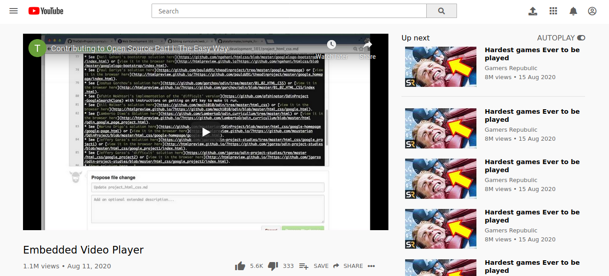

# Youtube-Clone
> This project consists of building an HTML document that matches the appearance of youtube [video player page](https://www.youtube.com/watch?v=FSehPxS_la8).

## Project Requirements

### Navigation bar
- It has an embedded image that represents a logo.
- The logo is aligned to the leftmost part of the navbar.
- It has an input tag that represents a search bar.
- The search bar is aligned to the middle of the navbar.
- It has a button tag that represents the search button.
- The search button is at the end (rightmost part) of the search bar.
- It has at least three embedded images on the rightmost part of the navbar that represent icons and/or an avatar.

### Video 
- It is displayed.
- It shows the video title.
- It shows the number of views.
- It has like and dislike icons.
- It has a share button.
- It shows the avatar of the user who uploaded the video.
- It has a subscribe button.

### Sidebar Recommended videos
- It shows the recommended video’s thumbnail preview (as image not as an actual video).
- It shows the title of the video.
- It shows the number of views.

## Built With

- HTML
- CSS

## Live Demo

[Live Demo Link](https://ceejayski.github.io/Youtube-Clone/)

## Authors

👤 **Author1**
- Github: [@Ceejayski](https://github.com/ceejayski)
- Twitter: [@Ceejaski1](https://twitter.com/Ceejayski1)
- Linkedin: [Okoli Chijioke](https://www.linkedin.com/in/okolichijioke/)

👤 **Author2**
- Github: [@Lichapa](https://github.com/Lichapa)
- Linkedin: [mphatsolichapa](https://www.linkedin.com/in/mphatsolichapa/)
